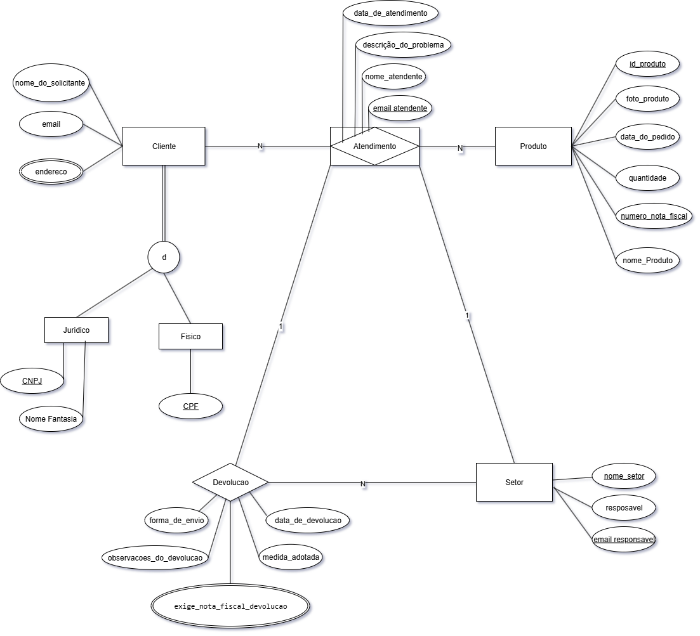

# **Sistema de Garantia Star 7**

 --- 
 
**Integrantes:** 
* Caio Cesar de Oliveira;
* Enzo Alves Barcelos Gripp;
* Lucca Favilla Campos De Paula;
* Gabriel Fernandes Souza;
* Pedro Dias Soares;
* Thiago Domingos Venturim Ribeiro dos Santos.

**Professores:**
* Prof. Marco Paulo Gomes
  
---

*Ciência de Dados e Inteligência Artificial*
*Instituto de Informática e Ciências Exatas – Pontifícia Universidade de Minas Gerais (PUC MINAS)*
*Belo Horizonte – Minas Gerais - 2025*

---

**Resumo:**

----

### SÚMARIO 

1 [INTRODUÇÃO](#Introducao)

2 [À EMPRESA STAR 7](#Empresa)

3 [ESPECIFICAÇÃO DO MINIMUNDO](#Mundo)

4 [MODELO CONCEITUAL](#Conceitual)

 
---
 

  
 
## 1- INTRODUÇÃO  

---

  
 
## 2-  À EMPRESA STAR 7 

A Star7 é uma empresa multinacional que atua no desenvolvimento, gestão, produção e logística de conteúdo em diferentes idiomas, oferecendo soluções completas para empresas de diversos setores. Sua missão é transformar produtos em histórias de sucesso em todo o mundo, unindo talento e tecnologia para ajudar clientes a maximizar seu potencial. 

Presente em três continentes e com mais de 1.250 colaboradores distribuídos em várias sedes globais (incluindo Brasil, Itália, Espanha, Alemanha, França e EUA), a Star7 oferece uma ampla gama de serviços, que vão desde engenharia de serviços, modelagem 3D, publicações técnicas, traduções, consultoria e comunicação, até impressão digital e offset, montagem de kits, logística Just in Time e gestão de terminologia. 

No Brasil, a empresa conta com unidades em Belo Horizonte, Betim, São Paulo e Porto Real (RJ), oferecendo suporte direto às necessidades de clientes locais e internacionais. A filosofia de trabalho Integrale7 garante uma abordagem global e integrada, cobrindo todas as etapas do projeto, desde a concepção até a entrega final. 

Reconhecida pela qualidade e inovação, a Star7 é certificada com ISO 9001:2015 e FSC® (Cadeia de Custódia), reforçando seu compromisso com a excelência e a sustentabilidade. 

---

  
 
## 3- ESPECIFICAÇÃO DO MINIMUNDO 

*O minimundo é uma descrição textual simplificada da realidade de um domínio específico que se deseja modelar em um banco de dados. Ele serve para identificar os elementos mais relevantes do sistema (entidades, atributos e relacionamentos) e estabelecer como essas informações se conectam entre si. Na prática, o minimundo atua como uma ponte entre o problema real e o modelo conceitual (por exemplo, o Diagrama Entidade-Relacionamento – DER), garantindo que somente os aspectos essenciais do negócio sejam representados no banco de dados. Assim, evita-se excesso de informações irrelevantes e garante-se que a modelagem atenda às necessidades do sistema a ser desenvolvido.*

A empresa Star 7 atua no desenvolvimento de manuais, kits de bordo, livros e outros materiais gráficos. O presente projeto modela o sistema de Garantia, responsável pelo tratamento de chamados de clientes referentes a problemas nos produtos entregues. 

Os clientes identificados por, e possuem também nome da empresa e outros dados de contato como e-mail e nome da pessoa que fez a solicitação, os Clientes podem ser físicos identificados por CPF ou jurídicos por CNPJ e nome fantasia. O cliente entra em contato com o setor de atendimento, informando-os dados do produto: o código da nota fiscal do produto, uma foto do defeito, a data do que foi realizada o pedido, a quantidade e o id do produto e o nome.	 

O atendimento deve anotar a data que foram realizados o próprio atendimento, o nome e o Email do funcionário uma descrição textual do problema, e após encaminhar para o setor. 

Os setores possuem nome e apenas um responsável por cada setor com registro do Email, o setor recebe o produto e o responsável deve analisar o problema e tomar as medidas necessárias.  Os setores envolvidos podem ser:  Kit de Bordo, Publicação Editorial, Publicação Técnica e Marketing. 

Cada chamado só pode estar associado a um setor por vez, ou seja, não é permitido que o mesmo problema seja registrado em dois setores simultaneamente. Entretanto, o setor que recebeu o chamado pode encaminhá-lo para outro setor caso identifique que o problema pertence a uma área diferente. Por exemplo, o setor de Kit de Bordo pode verificar que o defeito está no manual impresso e encaminhar o chamado para a Gráfica. 

Esse processo de encaminhamento pode se repetir até que o setor correto assuma a responsabilidade e finalize a solução. Assim que finalizado o produto deve ser encaminhado para a devolução. 

A devolução tem que ter uma data que foi solucionado, a forma de envio a medida adotada e as observações sobre a devolução e pôr fim a devolução encaminha para o cliente se o cliente for jurídico deve ser gerado uma nova nota fiscal de devolução referenciando a antiga. O mesmo produto pode voltar N vezes para a garantia 

 ---

  
 
## 4- MODELO CONCEITUAL 

*O modelo conceitual, é uma representação de alto nível e abstrata de um sistema, focada em descrever a estrutura, as entidades, seus atributos e os relacionamentos entre elas, com base em conceitos e regras de negócio. Ele ignora detalhes técnicos e de implementação, sendo usado para comunicação entre equipes de negócio e tecnologia, servindo como base para modelos mais detalhados, como os lógicos e físicos.* 

Essa seção apresenta o projeto conceitual do SAM. Figura 1 apresenta o diagrama entidade-relacionamento (ER) do modelo conceitual do Sistema de Garantia. 

Figura 1- Modelo Conceitual  

A entidade Cliente armazena os dados de identificação e contato dos solicitantes. Ela possui uma especialização disjunta e total em Pessoa Física e Pessoa Jurídica, de forma que cada cliente pertence obrigatoriamente a um desses tipos. Clientes físicos são identificados por CPF, enquanto clientes jurídicos possuem CNPJ e Nome Fantasia. 

A entidade Produto representa os itens adquiridos pelos clientes, contendo atributos como id do produto, nome do produto, foto do produto, data do pedido, quantidade e número da nota fiscal. Existe um relacionamento 1:N entre Cliente e Produto, indicando que um cliente pode possuir vários produtos cadastrados. 

A entidade Atendimento registra as ocorrências relacionadas a problemas nos produtos, incluindo os atributos data de atendimento, descrição do problema, nome atendente e email atendente. Cada atendimento está associado a um único cliente, podendo envolver um ou mais produtos relacionados a esse cliente. 

A entidade Setor representa as áreas internas responsáveis por analisar os atendimentos. Ela contém os atributos nome setor, responsável e email responsável. O relacionamento entre Atendimento e Setor é de N:1, ou seja, vários atendimentos podem ser encaminhados para um mesmo setor. 

A entidade Devolução registra o processo de retorno do produto após o atendimento, com os atributos data de devolução, forma de envio, medida adotada, observações da devolução e exige nota fiscal devolução. O relacionamento entre Atendimento e Devolução é de 1:N, permitindo que um mesmo atendimento gere várias devoluções, conforme a necessidade. 

O modelo conceitual apresenta ainda a integração entre as entidades Cliente, Produto, Atendimento, Setor e Devolução, garantindo a rastreabilidade de todas as etapas do processo. A estrutura proposta oferece uma visão clara e organizada dos relacionamentos possibilitando o gerenciamento eficiente das informações de garantia. 

 
    | Tipo               | Subtipo    | Rótulo                             | Descrição                                                                                                                                                     |
| ------------------ | ---------- | ---------------------------------- | ------------------------------------------------------------------------------------------------------------------------------------------------------------- |
| **Entidade**       | Forte      | **Cliente**                        | Armazena os dados de identificação e contato dos solicitantes. Possui uma especialização disjunta e total em Pessoa Física e Pessoa Jurídica.                 |
| **Entidade**       | Fraca      | **Físico**                         | Subtipo de Cliente que representa pessoas físicas, identificadas por CPF.                                                                                     |
| **Entidade**       | Fraca      | **Jurídico**                       | Subtipo de Cliente que representa pessoas jurídicas, identificadas por CNPJ e Nome Fantasia.                                                                  |
| **Entidade**       | Forte      | **Produto**                        | Representa os itens adquiridos pelos clientes, contendo id do produto, nome do produto, foto do produto, data do pedido, quantidade e número da nota fiscal.  |
| **Entidade**       | Forte      | **Atendimento**                    | Registra as ocorrências relacionadas a problemas nos produtos. Contém data de atendimento, descrição do problema, nome e email do atendente.                  |
| **Entidade**       | Forte      | **Setor**                          | Representa as áreas internas responsáveis pela análise dos atendimentos, contendo nome do setor, responsável e email do responsável.                          |
| **Entidade**       | Forte      | **Devolução**                      | Registra o processo de retorno de produtos após o atendimento, com data de devolução, forma de envio, medida adotada, observações e exigência de nota fiscal. |
| **Relacionamento** | 1:N        | **Cliente–Produto**                | Um cliente pode possuir vários produtos cadastrados.                                                                                                          |
| **Relacionamento** | 1:N        | **Cliente–Atendimento**            | Cada atendimento está associado a um único cliente, mas um cliente pode ter vários atendimentos.                                                              |
| **Relacionamento** | N:N        | **Atendimento–Produto**            | Um atendimento pode envolver um ou mais produtos relacionados a um cliente.                                                                                   |
| **Relacionamento** | N:1        | **Atendimento–Setor**              | Vários atendimentos podem ser encaminhados para um mesmo setor.                                                                                               |
| **Relacionamento** | 1:N        | **Atendimento–Devolução**          | Um mesmo atendimento pode gerar várias devoluções, conforme a necessidade.                                                                                    |
| **Atributo**       | Chave      | **CPF**                            | Identificador único da entidade Físico.                                                                                                                       |
| **Atributo**       | Chave      | **CNPJ**                           | Identificador único da entidade Jurídico.                                                                                                                     |
| **Atributo**       | Simples    | **Nome do Solicitante**            | Nome completo do cliente.                                                                                                                                     |
| **Atributo**       | Simples    | **Email**                          | Endereço eletrônico do cliente.                                                                                                                               |
| **Atributo**       | Simples    | **Endereço**                       | Local de residência ou sede do cliente.                                                                                                                       |
| **Atributo**       | Simples    | **Nome Fantasia**                  | Nome comercial da empresa (somente para Pessoa Jurídica).                                                                                                     |
| **Atributo**       | Chave      | **ID Produto**                     | Identificador único do produto.                                                                                                                               |
| **Atributo**       | Simples    | **Nome do Produto**                | Nome descritivo do produto.                                                                                                                                   |
| **Atributo**       | Simples    | **Foto do Produto**                | Imagem ilustrativa do produto.                                                                                                                                |
| **Atributo**       | Simples    | **Data do Pedido**                 | Data em que o produto foi adquirido.                                                                                                                          |
| **Atributo**       | Simples    | **Quantidade**                     | Número de unidades do produto.                                                                                                                                |
| **Atributo**       | Simples    | **Número da Nota Fiscal**          | Identificador fiscal do pedido.                                                                                                                               |
| **Atributo**       | Simples    | **Data de Atendimento**            | Data em que o atendimento foi registrado.                                                                                                                     |
| **Atributo**       | Simples    | **Descrição do Problema**          | Texto detalhando o problema relatado.                                                                                                                         |
| **Atributo**       | Simples    | **Nome do Atendente**              | Nome do funcionário responsável pelo atendimento.                                                                                                             |
| **Atributo**       | Simples    | **Email do Atendente**             | Endereço de e-mail do atendente.                                                                                                                              |
| **Atributo**       | Simples    | **Nome do Setor**                  | Nome da área interna responsável pelo atendimento.                                                                                                            |
| **Atributo**       | Simples    | **Responsável**                    | Nome do responsável pelo setor.                                                                                                                               |
| **Atributo**       | Simples    | **Email do Responsável**           | Endereço de e-mail do responsável pelo setor.                                                                                                                 |
| **Atributo**       | Simples    | **Data de Devolução**              | Data em que o produto foi devolvido.                                                                                                                          |
| **Atributo**       | Simples    | **Forma de Envio**                 | Método de envio utilizado na devolução.                                                                                                                       |
| **Atributo**       | Simples    | **Medida Adotada**                 | Ação tomada durante o processo de devolução.                                                                                                                  |
| **Atributo**       | Simples    | **Observações da Devolução**       | Informações adicionais sobre a devolução.                                                                                                                     |
| **Atributo**       | Simples    | **Exige Nota Fiscal de Devolução** | Indica se a devolução requer nota fiscal.                                                                                                                     |
| **Restrição**      | Totalidade | **Cliente–Subtipos**               | Especialização disjunta e total: todo cliente é Físico ou Jurídico.                                                                                           |

 
---

